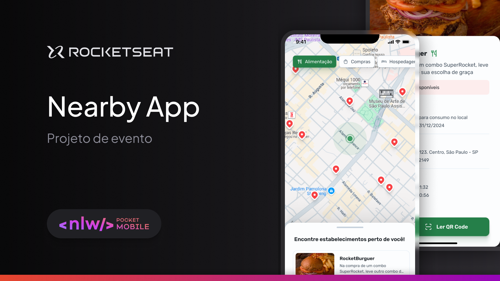

<h1 align="center"> Nearby </h1>

<p align="center"> 
    
</p>

<br>

<p align="center"> Um aplicativo mobile de clube de benefícios com cupons para utilizar em estabelecimentos próximos a você.</p>

<p align="center"> 
    <a href="#-sobre-o-projeto">Projeto</a>&nbsp;&nbsp;&nbsp;│&nbsp;&nbsp;&nbsp;
    <a href="#-tecnologias">Tecnologias</a>&nbsp;&nbsp;&nbsp;│&nbsp;&nbsp;&nbsp;
    <a href="#-features">Features</a>&nbsp;&nbsp;&nbsp;│&nbsp;&nbsp;&nbsp;
    <a href="#-dicas-para-usar-o-projeto">Dicas de uso</a>
</p>

### 💻 Sobre o projeto

O projeto é um aplicativo mobile inovador que conecta você a um clube de benefícios exclusivo. Com ele, você pode acessar cupons especiais e aproveitar descontos e vantagens incríveis em estabelecimentos próximos à sua localização. Uma solução prática e moderna para economizar enquanto desfruta dos melhores serviços e produtos ao seu redor.

### 🚀 Tecnologias

Esse projeto foi desenvolvido com as seguintes tecnologias:

- React Native e Expo
- Typescript
- Axios
- React Navigation e React Native Maps
- Node.js
- Express
- Restful API
- Git e Github
- Figma

### 🚧 Features

- [x] Welcome page
- [x] Adicionar navegação para próxima pagina
- [x] Tela do mapa
- [x] Navegação por categorias
- [x] Popup com exibição dos cupons disponíveis
- [x] Alterar posição do compass
- [x] Adicionar o botão para voltar a localização do usuário

### 💡 Dicas para usar o projeto

#### Mobile Setup

```bash
`cd nearby/mobile`

`npm install` │ `npm i`

`npx expo start` │ `npm start`
```

#### Backend API Setup

```bash
`cd nearby/api`

`npm install` │ `npm i`

`npx prisma generate`

`npm start`
```
